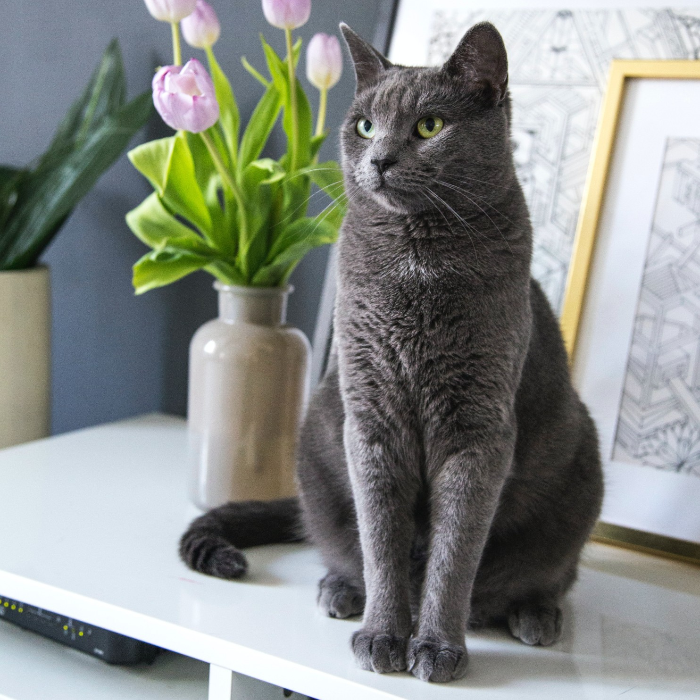

# Sparse_PEFT: Exploring Sparsity for Parameter-Efficient Fine-Tuning | [[Paper]](https://arxiv.org/abs/2505.12532)

<div align="center">
  <table>
    <tr>
      <td></td>
      <td></td>
      <td></td>
      <td></td>
      <td></td>
    </tr>
    <tr>
      <td></td>
      <td></td>
      <td></td>
      <td></td>
      <td></td>
    </tr>
    <tr>
      <td></td>
      <td></td>
      <td></td>
      <td></td>
      <td></td>
    </tr>
  </table>
  <p>The original images (top), WaveFT results (middle), LoRA results (bottom).</p>
</div>

## Overview

This repository contains the implementation and results of our research on sparse parameter-efficient fine-tuning methods for large pre-trained models. We explore the benefits of incorporating structured sparsity into PEFT approaches to achieve better parameter efficiency while maintaining or improving performance.

## Method

<div align="center">
  
</div>

## Usage

To use this repository, follow these steps:

1.  **Clone the repository:**
    ```bash
    git clone https://github.com/your-username/Sparse_PEFT.git
    cd Sparse_PEFT
    ```
2.  **Install dependencies:**
    ```bash
    pip install -r requirements.txt
    ```
3.  **Run experiments:**
    ```bash
    bash personalization.sh
    ```

<div align="center">
  
</div>

Comparison of different PEFT methods including our novel sparse approaches against baseline methods.

### Rank vs Sparsity Trade-off

<div align="center">
  
</div>

Analysis of the relationship between rank and sparsity parameters in our methods.

## WaveFT: Wavelet-based Fine-Tuning

<div align="center">
  
</div>

WaveFT leverages wavelet transformations to identify important parameter subspaces for efficient fine-tuning, achieving strong results with minimal parameter updates.

## Performance Metrics

<div align="center">
  
</div>

Comprehensive evaluation metrics across different tasks and model configurations.

## Directory Structure

- `assets/`: Visualizations and figures used in the paper
  - `waveft/`: WaveFT-specific results and visualizations
  - `lora/`: LoRA-specific results and visualizations
  - `dataset/`: Sample images used in the visualizations
- `dataset/`: Full dataset of subject images organized by category
  - Contains image data organized by instance names (dog, cat, etc.)
  - `prompts_and_classes_obj.txt`: Mapping between object instances and their classes
  - `prompts_and_classes_live.txt`: Mapping between live instances and their classes
- `peft/`: Modified version of Hugging Face PEFT to include WaveFT adapter
- `PyTorch-Wavelet-Toolbox-Custom/`: Modified version of the PyTorch Wavelet Toolbox for our implementation
- `sdxl_dreambooth/`: Code for fine-tuning Stable Diffusion XL with our methods
  - `train_sdxl.py`: Main training script
  - `run_evaluation.py`: Script for evaluating trained models
  - `evaluation.py`: Evaluation utilities
  - `dataset_loader.py`: Data loading utilities
  - `training_utils.py`: Training helper functions
  - `config/`: Configuration files for different PEFT methods
    - `waveft_config.yaml`: Configuration for WaveFT
    - `lora_config.yaml`: Configuration for LoRA
    - `adalora_config.yaml`: Configuration for AdaLoRA
    - `vera_config.yaml`: Configuration for VERA
    - `loha_config.yaml`: Configuration for LoHA
    - `lokr_config.yaml`: Configuration for LoKr
    - `fourierft_config.yaml`: Configuration for FourierFT
    - `training_config.yaml`: Base training configuration
    - `experiment_config.yaml`: General experiment settings
- `other_scripts/`: Additional training scripts for different PEFT methods
  - `lora_personalization.sh`: LoRA training script
  - `adalora_personalization.sh`: AdaLoRA training script
  - `vera_personalization.sh`: VERA training script
  - `loha_personalization.sh`: LoHA training script
  - `lokr_personalization.sh`: LoKr training script
  - `fourierft_personalization.sh`: FourierFT training script
  - `lora_rank_test.sh`: Script for testing different LoRA ranks
- `outputs/`: Directory for storing training outputs and generated images
  - `config/`: Configurations used for training
- `example_outputs/`: Example generation outputs and configuration files
- `personalization.sh`: Main script to run training and evaluation
- `requirements.txt`: Python dependencies needed to run the code

## Dataset Acknowledgment

The dataset used in this work is from the [DreamBooth repository](https://github.com/google/dreambooth) by Google. We use their dataset of subjects for our fine-tuning experiments to maintain consistency with prior work and enable fair comparison.

## Acknowledgements

This work utilizes the following open-source libraries:

- **Hugging Face PEFT**: A library for state-of-the-art parameter-efficient fine-tuning methods.
  - Repository: [https://github.com/huggingface/peft](https://github.com/huggingface/peft)
  - Citation:
    ```bibtex
    @Misc{peft,
      title =        {PEFT: State-of-the-art Parameter-Efficient Fine-Tuning methods},
      author =       {Sourab Mangrulkar and Sylvain Gugger and Lysandre Debut and Younes Belkada and Sayak Paul and Benjamin Bossan},
      howpublished = {\url{https://github.com/huggingface/peft}},
      year =         {2022}
    }
    ```

- **PyTorch Wavelet Toolbox (ptwt)**: A toolbox for differentiable fast wavelet transforms in PyTorch with GPU support.
  - Repository: [https://github.com/v0lta/PyTorch-Wavelet-Toolbox](https://github.com/v0lta/PyTorch-Wavelet-Toolbox)
  - Citation:
    ```bibtex
    @article{JMLR:v25:23-0636,
      author  = {Moritz Wolter and Felix Blanke and Jochen Garcke and Charles Tapley Hoyt},
      title   = {ptwt - The PyTorch Wavelet Toolbox},
      journal = {Journal of Machine Learning Research},
      year    = {2024},
      volume  = {25},
      number  = {80},
      pages   = {1--7},
      url     = {http://jmlr.org/papers/v25/23-0636.html}
    }
    ```

## Citation

If you find this work useful, please cite our paper:

```bibtex
@misc{bilican2025exploringsparsityparameterefficient,
      title={Exploring Sparsity for Parameter Efficient Fine Tuning Using Wavelets}, 
      author={Ahmet Bilican and M. Akın Yılmaz and A. Murat Tekalp and R. Gökberk Cinbiş},
      year={2025},
      eprint={2505.12532},
      archivePrefix={arXiv},
      primaryClass={cs.CV},
      url={https://arxiv.org/abs/2505.12532}, 
}
```

## License

This project is licensed under the [Attribution-NonCommercial-ShareAlike 4.0 International (CC BY-NC-SA 4.0)](https://creativecommons.org/licenses/by-nc-sa/4.0/) license.


