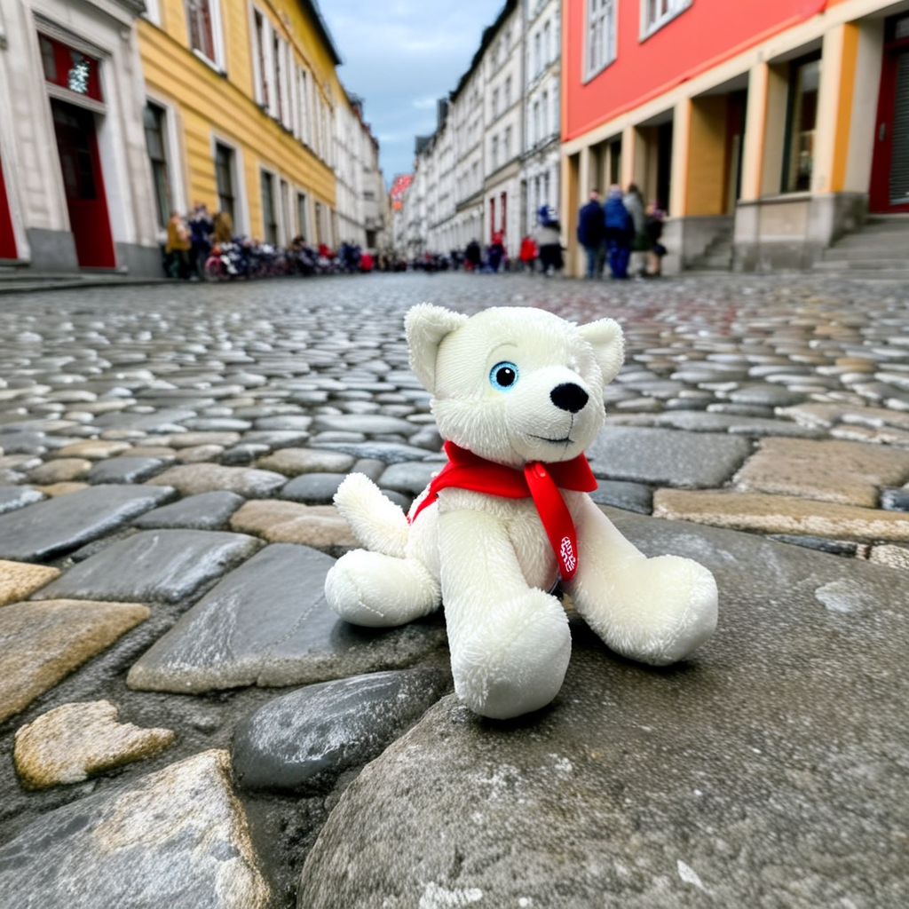

# Sparse_PEFT: Exploring Sparsity for Parameter-Efficient Fine-Tuning | [[Paper]](https://arxiv.org/abs/2505.12532)

<div align="center">
  <table>
    <tr>
      <td></td>
      <td></td>
      <td></td>
      <td></td>
      <td></td>
    </tr>
    <tr>
      <td></td>
      <td></td>
      <td></td>
      <td></td>
      <td></td>
    </tr>
    <tr>
      <td></td>
      <td></td>
      <td></td>
      <td></td>
      <td></td>
    </tr>
  </table>
  <p>The original images (top), WaveFT results (middle), LoRA results (bottom).</p>
</div>

## Overview

This repository contains the implementation and results of our research on sparse parameter-efficient fine-tuning methods for large pre-trained models. We explore the benefits of incorporating structured sparsity into PEFT approaches to achieve better parameter efficiency while maintaining or improving performance.


Note: There are some issues that are going to be fixed shortly.

## Key Contributions

- Introduction of novel sparse PEFT methods that combine the benefits of sparse neural networks with parameter-efficient fine-tuning
- Comprehensive evaluation of existing and novel PEFT methods across multiple tasks and model architectures
- Development of WaveFT, a wavelet-based approach to sparse fine-tuning
- Extensive comparison with existing methods like LoRA (Low-Rank Adaptation)
- Analysis of performance vs. parameter count trade-offs

## Method

<div align="center">
  
</div>

## Results

### PEFT Method Comparison

<div align="center">
  
</div>

Comparison of different PEFT methods including our novel sparse approaches against baseline methods.

### Rank vs Sparsity Trade-off

<div align="center">
  
</div>

Analysis of the relationship between rank and sparsity parameters in our methods, showing how different configurations affect model performance.

## WaveFT: Wavelet-based Fine-Tuning

<div align="center">
  
</div>

WaveFT leverages wavelet transformations to identify important parameter subspaces for efficient fine-tuning, achieving strong results with minimal parameter updates.

## Performance Metrics

<div align="center">
  
</div>

Comprehensive evaluation metrics across different tasks and model configurations.

## Directory Structure

- `assets/`: Visualizations and figures
  - `waveft/`: WaveFT-specific results and visualizations
  - `lora/`: LoRA-specific results and visualizations
  - `dataset/`: Dataset examples and visualizations

## Dataset Acknowledgment

The dataset used in this work is from the [DreamBooth repository](https://github.com/google/dreambooth) by Google. We use their dataset of subjects for our fine-tuning experiments to maintain consistency with prior work and enable fair comparison.

## Citation

If you find this work useful, please cite our paper:

```bibtex
@misc{bilican2025exploringsparsityparameterefficient,
      title={Exploring Sparsity for Parameter Efficient Fine Tuning Using Wavelets}, 
      author={Ahmet Bilican and M. Akın Yılmaz and A. Murat Tekalp and R. Gökberk Cinbiş},
      year={2025},
      eprint={2505.12532},
      archivePrefix={arXiv},
      primaryClass={cs.CV},
      url={https://arxiv.org/abs/2505.12532}, 
}
```

## License

This project is licensed under the [Attribution-NonCommercial-ShareAlike 4.0 International (CC BY-NC-SA 4.0)](https://creativecommons.org/licenses/by-nc-sa/4.0/) license.


